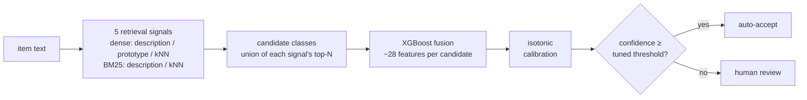

# Hybrid retrieval-fusion text classifier

Classifies short free text into one of many text-described classes — and
**abstains when it isn't confident enough**, routing those items to a human
instead of guessing. Five retrieval signals (dense + lexical, over class
descriptions + labeled examples) are fused by a small XGBoost model into a
calibrated `P(correct)`, and the abstention threshold is tuned to hold a target
accuracy on what it accepts. Built for **imbalanced data**, **air-gapped
deployment**, and **taxonomies that grow after the model ships**.



## Results

From the two runnable examples in [`examples/`](examples/) (commands to
reproduce are in each example's README).

**[CLINC150](examples/clinc150/)** — 150 user intents plus an explicit
**out-of-scope (OOS)** set. 40-intent subsample, fully offline TF-IDF encoder
(the floor a real bi-encoder improves on); illustrative — exact numbers vary
with subsample and seed. The operating point is a knob — the threshold is tuned
so accepted items hit the target accuracy:

| operating point | in-scope coverage | accuracy on accepted | OOS routed to human |
|---|---|---|---|
| `--target-precision 0.99` | 76.5% | 96.5% | 88.6% |
| `--target-precision 0.999` | 58.8% | 97.9% | 96.7% |

**[COICOP Hebrew](examples/coicop_hebrew/)** — short, messy Hebrew retail
product names. First **zero-shot**: Hebrew items matched against
English-language COICOP 2018 category descriptions with a multilingual
encoder — no labeled data at all. Then **trained**: on ~160k labeled items
across an 81-category retail taxonomy, the full pipeline reaches **~61%
coverage at ~90% accuracy-on-accepted** on the held-out split — i.e. ~61% of a
real product catalog auto-coded at production precision, the rest queued for
human review.

The risk–coverage trade-off is the product: every trained model ships an
`evaluation.json` with the full curve, so you pick the operating point from
*your* cost of a wrong answer vs. a human review.

## Quickstart

```bash
pip install .
text-classifier-train --items items.csv --classes classes.csv --out model_dir/
text-classifier-infer --model model_dir/ --input new_items.csv --output preds.csv
```

`items.csv` is `text,label`; `classes.csv` is `key,description`. `preds.csv`
carries a prediction + calibrated confidence per row; abstained rows have an
empty `predicted_key` — that's the human-review queue. No data yet?
`python -m scripts.demo` runs an offline end-to-end smoke test (no downloads).

## How it works

Five retrieval signals are scored for every item against a candidate set of
classes, then a single pointwise model fuses them into a calibrated
`P(this candidate is the true class)`:

1. dense item ↔ class-**description** similarity (bi-encoder)
2. dense item ↔ class-**prototype** similarity (mean of a class's example embeddings)
3. dense **kNN** over training examples
4. BM25 item ↔ class-description
5. BM25 **kNN** over training examples

Description and prototype are kept separate on purpose: their disagreement is a
useful feature. The candidate set is the union of each signal's top-N, so
**candidate recall is the ceiling on accuracy** and is reported every run.

The fusion model is **pointwise** — one shared binary model over ~28 features per
(item, candidate). 

Confidence is isotonic-calibrated, and a threshold is tuned for a target
accuracy (max coverage subject to accuracy ≥ target), with per-class thresholds
where a class had enough calibration support.

### Leakage control

* **Out-of-fold features** — each item is scored against indices/prototypes built
  from *other* folds (`StratifiedKFold`).
* **Held-out calibration/test** — thresholds and the coverage report come from
  folds the fusion model never trained on.
* **Encoder** — by default a single shared encoder is used (cheap). For full
  rigor, set `use_per_fold_encoder=True` to fine-tune a fresh encoder per fold.
  The encoder is fine-tuned with `MultipleNegativesSymmetricRankingLoss` on
  (item, class-description) pairs.

## Layout (domain-driven / hexagonal)

```
text_classifier/
  domain/           framework-free core
    models.py         value objects + LabelSpace aggregate
    ports.py          abstract interfaces (encoder, retrievers, fusion, calibrator)
    services.py       feature schema, candidate/abstention policies, threshold tuner
  infrastructure/   adapters implementing the ports
    encoder.py        SentenceTransformer + MNR-symmetric fine-tuning
    retrieval.py      BM25 (precomputed weight matrix) + dense retriever w/ prototypes
    fusion.py         XGBoost fusion model + isotonic calibrator
    persistence.py    save/load a model directory
  application/      use cases
    features.py       vectorized (item, candidate) feature assembler
    scoring.py        confidence + per-item argmax (shared by both pipelines)
    training.py       TrainingPipeline   <-- training entry point
    inference.py      InferencePipeline  <-- inference entry point
  config.py         configuration dataclasses
scripts/
  train.py          CLI: train from CSVs -> model directory
  infer.py          CLI: model directory + CSV -> predictions
  demo.py           offline smoke test (HashingEncoder double; no model download)
```

The domain layer imports no ML framework; infrastructure depends on the domain;
the application layer orchestrates through the ports. The two pipelines are the
public entry points.

## Efficiency notes

* Every signal is computed as a `(batch × n_classes)` matrix; candidate rows are
  gathered with numpy fancy-indexing — no per-row Python loops.
* BM25 precomputes a per-(doc, term) weight matrix `W`; because query-term
  frequency is ignored, scoring a query batch is the sparse mat-mul
  `Q_binary @ W.T`.
* kNN and feature assembly are query-chunked to bound peak memory.

## Install

```bash
pip install .                 # core (includes sentence-transformers)
pip install .[lightgbm]       # + optional LightGBM fusion backend
pip install .[test]           # + pytest for the test suite
```

Installing exposes three console commands — `text-classifier-train`,
`text-classifier-infer`, and `text-classifier-eval`. From a source checkout you
can equivalently run `python -m scripts.train` / `scripts.infer` /
`text_classifier.cli.evaluate`.

### Air-gapped / reproducible install

`requirements.lock` pins the full transitive dependency tree (torch included)
with sha256 hashes, resolved for the reference platform: **Linux x86_64,
CPython 3.11**. On a connected host, build a wheelhouse:

```bash
pip download --require-hashes -r requirements.lock -d wheelhouse/
pip wheel . --no-deps -w wheelhouse/     # the package itself
```

Move `wheelhouse/` to the air-gapped host, then install with no index access —
`--require-hashes` guarantees the installed wheels are byte-identical to the
ones that were tested:

```bash
pip install --no-index --find-links wheelhouse/ --require-hashes -r requirements.lock
pip install --no-index --find-links wheelhouse/ --no-deps text-classifier
```

**Refresh policy.** The lock is refreshed deliberately, never implicitly:

```bash
uv pip compile pyproject.toml --generate-hashes --python-version 3.11 -o requirements.lock
```

then re-run the test suite and the quality benchmark before committing the
diff. Heavy ML wheels (torch, xgboost) therefore only change versions when
revalidated. The default resolution locks the standard (GPU-enabled) torch
build; for a CPU-only deployment, compile with
`--extra-index-url https://download.pytorch.org/whl/cpu` to lock the much
smaller CPU wheels instead. A scheduled CI workflow (`lockfile.yml`) rebuilds
the wheelhouse and performs the offline install monthly, so a yanked or
re-uploaded wheel is noticed before deployment day.

## Usage

Train (writes the model directory plus `evaluation.json` and `model_card.md`):

```bash
text-classifier-train \
    --items items.csv \        # columns: text,label
    --classes classes.csv \    # columns: key,description
    --out model_dir/ \
    --target-precision 0.95
# add --per-fold-encoder for the rigorous (expensive) encoder path
```

By default this also writes `corpus.jsonl.gz` (the raw text+label pairs) into
the model directory — pass `--no-store-corpus` to opt out for privacy/size.
It costs little and is what lets `text-classifier-update` (below) add labeled
examples later without needing the original items file again.

For a torch-free, air-gapped run (no torch, no model download) use the TF-IDF
encoder backend (corpus-fitted, so `--encoder` is ignored). For a
dependency-free smoke test there is also a non-semantic `hashing` encoder:

```bash
text-classifier-train --items items.csv --classes classes.csv \
    --out model_dir/ --encoder-kind tfidf
```

Every `PipelineConfig` field (fusion kind + `xgb_params`, calibration kind,
BM25 token kwargs, encoder params, ...) is reachable from the CLI via
`--config`, without writing Python. Precedence is defaults < `--config` file <
explicit flags, and `--dump-config` prints the effective config and exits — a
trained model dir's `meta.json` `config` block is itself a valid `--config`
input, so you can inspect or replay a previous run's settings:

```json
// config.json — a partial config; unspecified fields keep their defaults
{
  "fusion": {"kind": "lightgbm"},
  "calibration": {"kind": "beta"},
  "retrieval": {"bm25_token_kwargs": {"stop_words": null}}
}
```

```bash
text-classifier-train --config config.json --items items.csv \
    --classes classes.csv --out model_dir/ --folds 3   # --folds wins over the file
text-classifier-train --config config.json --dump-config  # inspect, don't train
```

**Bring your own validation / test split:** by default the calibration and test
sets are carved out of `--items` by the internal k-fold split. If you already
hold a split — a frozen benchmark test set, a temporally-later validation slice,
or a split shared across model families for comparability — hand it in directly
and keep the persisted evidence chain (`evaluation.json` / `model_card.md`)
instead of holding the test set outside the tool:

```bash
# External validation set → calibrate + tune abstention thresholds on it.
text-classifier-train --items train.csv --classes classes.csv --out model_dir/ \
    --val-items val.csv

# External test set → the held-out evaluation runs on it.
text-classifier-train --items train.csv --classes classes.csv --out model_dir/ \
    --test-items test.csv

# Both → every internal fold trains the fusion model, so --folds 2 is enough.
text-classifier-train --items train.csv --classes classes.csv --out model_dir/ \
    --val-items val.csv --test-items test.csv --folds 2

# Both, --folds 1 → leave-one-out: each training item is scored against every
# other (itself masked out) rather than a k-fold split — the maximum-size,
# deployment-matching index while staying leakage-free.
text-classifier-train --items train.csv --classes classes.csv --out model_dir/ \
    --val-items val.csv --test-items test.csv --folds 1
```

Each external set is optional and independent, reuses `--text-col`/`--label-col`,
and must be **disjoint** from `--items`: an item whose text also appears in the
training pool sits in the deployed index, self-retrieves a perfect match, and
silently inflates the numbers — so text overlap is a hard error, not a warning.
The manifest in `evaluation.json` records where each split came from
(`"splits": {"val": "external:n=1234", "test": "internal-fold"}`) so a model
directory stays auditable.

The **temporal split** is the case this exists for: calibrating on a *later*
slice (and evaluating on a still-later one) is the drift-realistic operating
point the internal random folds cannot express. External sets are featurized
against the index built from all training items — the same index that ships in
the model — so their scores, and the risk-coverage numbers derived from them,
describe deployed behaviour. (This is a deliberate asymmetry: the fusion model
is fit on per-fold-index features while the calibrator sees full-train-index
features, anchoring confidence at the production operating point.)

**Leave-one-out (`--folds 1`)** is available only with *both* external sets,
because with no calibration or test role left to carve, the internal folds exist
solely to keep the fusion model's own training features leakage-free. Instead of
a k-fold split, each training item is featurized against the full deployment
index with *itself* masked out — its dense/BM25 self-match dropped and its own
vector left out of its class prototype. This gives every item the largest,
most deployment-like index possible while still honouring the rule that an item
never sees itself in its own index. It is the most faithful (and, at `O(n)`
larger, the most expensive) fusion-training featurization; use `--folds 2` for
the cheaper k-fold out-of-fold split. Leave-one-out has no per-item fit hook for
custom fusion feature providers, so it rejects a config that sets any.

**Non-English / multilingual corpora:** BM25 applies no stopword filtering by
default — `stop_words` is an explicit opt-in
(`--bm25-stop-words english`/`--config` with `{"retrieval": {"bm25_token_kwargs":
{"stop_words": "english"}}}`), not a hidden assumption that would silently
degrade BM25 on non-English text. Tokenization itself (`CountVectorizer`'s
default `token_pattern`) is already Unicode-aware. `EncoderConfig.params`
accepts the same idea for TF-IDF (`stop_words`, `token_pattern`, ...). For the
dense/description-similarity signals, pick a multilingual sentence-transformer
model via `--encoder` — see `examples/coicop_hebrew/` for a worked
cross-lingual example.

**Instruction-tuned encoders (E5/BGE/GTE...):** these models expect role
prefixes — queries and documents encoded differently. Configure them via
`--config`; the prompts persist into the model dir, so inference applies them
automatically:

```json
{
  "encoder": {
    "model_name_or_path": "intfloat/multilingual-e5-base",
    "query_prompt": "query: ",
    "document_prompt": "passage: "
  }
}
```

Items being classified get the query prompt; the example pool and class
descriptions get the document prompt. `encoder.encode_kwargs` passes extra
options to `SentenceTransformer.encode` (e.g. `{"truncate_dim": 256}`);
`normalize_embeddings`/`convert_to_numpy` are always forced so embeddings stay
L2-normalized (dot product == cosine). Omit all of it and encoding is
symmetric, exactly as before.

Predict:

```bash
text-classifier-infer --model model_dir/ --input new_items.csv --output preds.csv
```

For a human-review queue, `--top-k N` adds the next-best suggestions as wide
columns (`top2_key`, `top2_conf`, … `topN_key`, `topN_conf`) alongside the
usual top-1 `predicted_key`/`top_key`/`confidence`/`abstained` columns, which
are unchanged — abstention stays a top-1 decision, the extra columns are just
candidates for a reviewer to pick from:

```bash
text-classifier-infer --model model_dir/ --input new_items.csv --output preds.csv --top-k 3
```

Evaluate a trained model on a labeled set (coverage, accuracy-on-accepted,
calibration — Brier/ECE — a risk-coverage curve, and a per-class breakdown).
Use it to validate before deploying, or to watch for drift over time:

```bash
text-classifier-eval --model model_dir/ --input labeled.csv --output report.json
```

Each trained model directory carries its own evidence: `evaluation.json` (the
full held-out report) and `model_card.md` (a human-readable summary with the
package version, dataset shape, headline metrics, and the abstention thresholds).

**Move the coverage/precision operating point without retraining:** the target
precision → abstention threshold is normally baked in at train time. Moving
that knob — or responding to drift `text-classifier-eval` surfaced — does not
require a full retrain: the encoder, retrieval indices, and fusion model are
reused verbatim, and only the calibrator + thresholds are refit, on arrays the
model already produces (seconds of work, not a k-fold pass over the corpus):

```bash
text-classifier-tune --model model_dir/ --input fresh_labeled.csv \
    --target-precision 0.97
# --dry-run prints the would-be coverage/accuracy/thresholds and writes nothing
```

This updates `calibrator.pkl` and `meta.json`'s abstention block in place, and
writes a fresh `evaluation.json`/`model_card.md` reflecting the new operating
point (with a `retunes` provenance entry recording when and on how many items).

**The labeled set must be fresh.** An item that was in the original training
set sits inside the deployed retrieval indices and retrieves itself as a
perfect match, so its confidence is optimistically inflated — the retuned
threshold would then under-abstain in production. Never point `--input` at the
file used for `text-classifier-train --items`. The tool warns when a tune-set
item looks like a (near-)exact embedding match to an indexed training example
— a cheap, best-effort proxy; it cannot check exact text identity without the
persisted training corpus itself (a future capability), so treat the absence of
a warning as reassuring, not as proof.

**Grow the taxonomy without retraining:** a deployed model's label space can be
widened after training — for a class that appears once the model has shipped, or
to evaluate against a test set with labels the training data never contained.
Because every feature is a per-*candidate* retrieval signal (there is no
per-class output dimension), the trained fusion model, calibrator, and
abstention policy are reused verbatim; only the class-indexed retrieval state
grows. New classes are appended at the end, so every existing class index — and
therefore every existing item's prediction — is unchanged.

```python
from text_classifier import ClassDefinition, InferencePipeline

pipe = InferencePipeline.from_directory("model_dir/")
pipe = pipe.with_added_classes([
    ClassDefinition("REFURBISHED_PHONES", "second-hand and refurbished mobile phones"),
    ("PET_INSURANCE", "insurance policies for pets"),   # (key, description) also accepted
])
pipe.predict(["cheap used iphone"])   # can now return REFURBISHED_PHONES
```

A class added this way is **description-only**: with no training examples it has
no class prototype and no kNN support (`class_freq = 0`). It is retrievable and
can win a query on description similarity alone, but the fusion model — trained
when every candidate had example support — assigns it a *low calibrated
confidence*, so under a precision-tuned abstention threshold it will usually
route to human review rather than auto-accept. That is the honest signal for a
class with no example evidence. The recommended lifecycle: add the class at
inference for immediate (cautious) coverage, collect examples from the reviewed
queue, and retrain once at least `n_folds` examples exist — the encoder is
frozen, so retraining is cheap and lifts the class to full confidence.

To score a labeled set whose labels exceed the trained taxonomy, pass the wider
class list to the eval CLI with `--classes`; any class not seen at training is
added description-only before scoring:

```bash
text-classifier-eval --model model_dir/ --input labeled.csv \
    --classes full_taxonomy.csv --output report.json
```

**Persist taxonomy/example changes to a model directory:** `with_added_classes`
above only widens a pipeline *in memory* — reload the directory and you're back
to the trained taxonomy. `text-classifier-update` does the same class-agnostic
trick, but writes the result back to a model directory, and can also add real
labeled *examples* (for a new or an existing class), not just descriptions:

```bash
text-classifier-update \
    --model model_dir/ --out updated_model_dir/ \
    --classes full_taxonomy.csv \    # every existing key + any new ones (edited descriptions are re-embedded)
    --items new_examples.csv \       # optional: new labeled examples (text,label)
    --tune-with fresh_labeled.csv     # optional: re-tune thresholds in the same run
```

`--classes` is the *full* taxonomy (same shape as `--classes` at train time):
every key already in the model must be present — `update` never removes or
reorders a class, so a file that drops one is rejected with a message telling
you to retrain instead. A key not yet in the model is appended; an existing
key whose description text changed gets just that description re-embedded.

Adding examples (`--items`) needs the original training corpus, because BM25's
IDF is corpus-global and can't be updated incrementally. By default this comes
from `corpus.jsonl.gz`, written into every model directory unless you passed
`--no-store-corpus` at train time; for a directory that predates it (or opted
out), supply the original items with `--base-items original_items.csv`. Only
the *new* texts are re-encoded — the existing example embeddings are reused
verbatim, so cost scales with the delta, not the whole corpus.

Without `--tune-with`, abstention thresholds are left as they were (a new
class falls back to the global threshold, same as `with_added_classes`), and
the model directory's `evaluation.json`/`model_card.md` are carried forward
but marked stale (their headline metrics predate the update) — run
`text-classifier-tune` on fresh labeled data afterward. Pass `--tune-with` to
do both in one step and get a fresh evaluation, including candidate recall for
the classes you just added — the evidence for whether their descriptions/
examples actually retrieve. Everything is provenance-tracked: `meta.json`
gains an `updates` entry (timestamp, classes/items added, package version)
each time.

Use `--in-place` to overwrite `--model` directly instead of writing a new
directory.

### Worked examples

The two demos behind the [Results](#results) table, each with a cell-by-cell
notebook walkthrough and a command-line equivalent in its README:

- **[`examples/clinc150/`](examples/clinc150/)** — calibrated abstention on
  CLINC150, fully offline: raising the confidence bar routes more out-of-scope
  queries to a human while keeping in-scope accuracy high. Start with
  `clinc150_abstention_demo.ipynb`.
- **[`examples/coicop_hebrew/`](examples/coicop_hebrew/)** — cross-lingual
  zero-shot (Hebrew items ↔ English COICOP descriptions, no labels), then the
  full trained pipeline once labels exist. Start with
  `coicop_hebrew_classification.ipynb`.

Library:

```python
from text_classifier import (PipelineConfig, LabelSpace, LabeledItem,
                             ClassDefinition, TrainingPipeline, InferencePipeline)

label_space = LabelSpace([ClassDefinition("CLS001", "invoices and billing"), ...])
items = [LabeledItem("late fee on my bill", "CLS001"), ...]

artifacts, report = TrainingPipeline(PipelineConfig()).run(items, label_space, output_dir="model_dir/")
print(report)  # coverage / accuracy-on-accepted / candidate recall

preds = InferencePipeline.from_directory("model_dir/").predict(["where is my refund"])
```

## Contributing / releasing

See `CONTRIBUTING.md` for dev setup, the test/lint/type gates, and the
`.claude/tasks/` ticket workflow. See `CHANGELOG.md` for what changed between
versions, and `RELEASING.md` for how a version is cut and built. Report
security issues per `SECURITY.md` rather than as a public issue.

